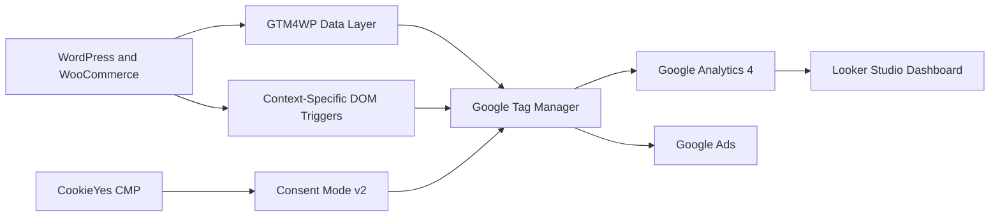
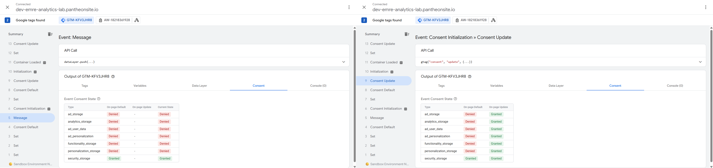
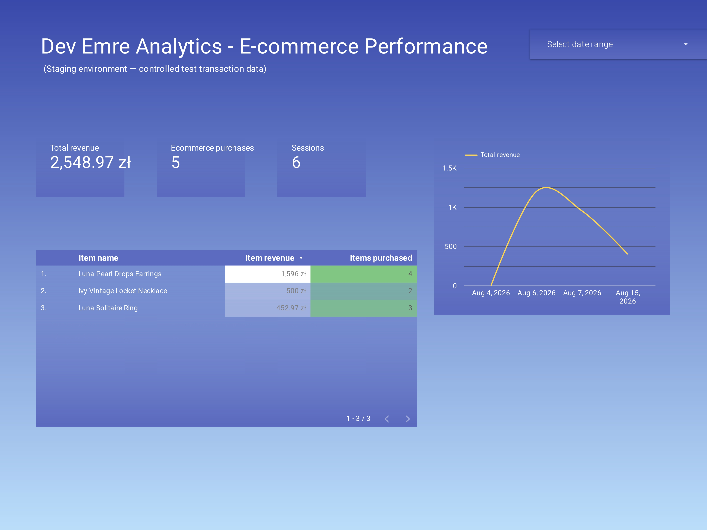

# Dev Emre Analytics Lab

## Privacy-Aware Ecommerce Analytics Implementation

**Dev Emre Analytics Lab** is an end-to-end digital analytics portfolio project built in a WordPress and WooCommerce staging environment.

The project demonstrates how an ecommerce measurement architecture can be planned, implemented, troubleshot, validated and documented using Google Tag Manager, Google Analytics 4, Google Ads, Google Consent Mode v2, CookieYes, GTM4WP and Looker Studio.

> This is a staging and portfolio environment. It does not contain real customer transactions or production customer data.

---

## Live Project Resources

* **Staging Website:** https://dev-emre-analytics-lab.pantheonsite.io/
* **Looker Studio Dashboard:** https://datastudio.google.com/reporting/993b9423-671e-455e-a6cb-0db83093668d
* **Measurement Plan:** [Download the Excel measurement plan](./measurement-plan/Dev_Emre_Analytics_Lab_Measurement_Plan.xlsx)

---

## Technology Stack

* WordPress
* WooCommerce
* Google Tag Manager
* Google Analytics 4
* Google Ads
* Google Consent Mode v2
* CookieYes CMP
* GTM4WP
* Looker Studio
* Google Tag Assistant
* GA4 DebugView
* Chrome Developer Tools

### Environment

* **GTM Container:** `GTM-KFV3JHR8`
* **GA4 Measurement ID:** `G-HHFN1QGW12`
* **Google Ads Destination:** `AW-18218361928`
* **Store Currency:** `PLN`

---

## Measurement Architecture



Google Tag Manager acts as the central measurement, governance and routing layer.

Structured WooCommerce ecommerce data is consumed from the `dataLayer` where available. Documented DOM-based triggers are used as a fallback for WooCommerce interactions that do not expose the expected GTM4WP ecommerce event.

---

## Validated Implementation Scope

### Consent Mode v2

CookieYes was integrated with Basic Google Consent Mode v2.

The following consent signals were validated:

* `analytics_storage`
* `ad_storage`
* `ad_user_data`
* `ad_personalization`

The validation confirmed that:

* Consent defaults are available before measurement tags are evaluated.
* All four signals are denied by default.
* Relevant signals update after explicit user consent.
* Consent preferences persist across subsequent navigation.
* Google measurement tags are gated according to the configured Basic Mode architecture.

These are supplementary privacy and measurement controls. They do not replace explicit consent or guarantee complete attribution preservation.



---

### Core Ecommerce Funnel

The validated ecommerce measurement flow covers:

* `page_view`
* `add_to_cart`
* `begin_checkout`
* `purchase`

Where structured ecommerce data is available, GTM uses the WooCommerce ecommerce object instead of recreating product parameters manually.

Validated ecommerce parameters include:

* `items`
* `value`
* `currency`
* `transaction_id`
* Item identifiers
* Product names
* Prices
* Quantities

---

### WooCommerce Add-to-Cart Troubleshooting

The WooCommerce block theme did not consistently generate the expected GTM4WP `add_to_cart` event for all button contexts.

The issue was investigated using:

* GTM Preview
* Tag Assistant
* `dataLayer` inspection
* DOM inspection
* Click-variable analysis
* CSS selector analysis

Context-specific click triggers were created for the affected WooCommerce button variants.

The final setup produced one corresponding measurement event for each tested interaction.

#### Known Semantic Limitation

The DOM fallback measures **add-to-cart intent**.

A button click does not independently confirm that the WooCommerce AJAX request or backend cart mutation completed successfully. A future production improvement would dispatch the event only after a confirmed cart update.

---

### Google Ads Purchase Routing

Custom GTM Data Layer Variables retrieve the following purchase values:

* Transaction value
* Currency
* WooCommerce transaction ID

These values are mapped to the native Google Ads purchase conversion tag together with the intended Conversion ID and Conversion Label.

Tag Assistant validation confirmed that the Google Ads purchase tag fired on the purchase event with:

* Dynamic conversion value
* `PLN` currency
* Unique WooCommerce transaction ID
* Intended Conversion ID
* Intended Conversion Label

This validates the GTM-to-Google-Ads routing configuration. It does not claim that a staging test order received real advertising attribution.

---

### Purchase Refresh and Deduplication QA

A controlled refresh test was performed on the WooCommerce order-confirmation page.

For the tested order flow:

* Refreshing the page did not cause the GA4 purchase tag to fire again.
* Refreshing the page did not cause the Google Ads purchase tag to fire again.
* A unique WooCommerce transaction ID was passed to the advertising destination to support destination-level duplicate handling.

This result documents protection for the tested order-confirmation flow. It should not be interpreted as a universal guarantee against every possible duplicate-event condition.

---

### Authenticated User-ID Lifecycle

Authenticated-user measurement uses a pseudonymous internal visitor identifier.

The QA process confirmed that:

* A stable identifier is available after authentication.
* The identifier is mapped to the GA4 User-ID configuration.
* The identifier is removed after logout.
* Subsequent anonymous activity does not retain the previous authenticated identifier.
* No raw email address is used as the GA4 User-ID or sent as a standard GA4 event parameter.

The public QA screenshots redact the actual identifier values.

---

### Dynamic 404 Monitoring

WordPress exposes the following page-context value on 404 pages:

```text
pagePostType: "404-error"
```

Google Tag Manager uses this value to send the custom GA4 event:

```text
page_not_found
```

The event includes:

* `page_location`
* `page_referrer`

This supports broken-link, SEO and user-journey analysis.

---

## Looker Studio Dashboard

The GA4 property is connected to a business-facing Looker Studio dashboard.

The dashboard includes:

* Total revenue
* Ecommerce purchases
* Sessions
* Average order value
* Product-funnel reporting
* Date-range controls



---

## QA Evidence

The public repository contains a focused evidence set rather than screenshots of every individual test.

| Area            | Evidence                                                                                       |
| --------------- | ---------------------------------------------------------------------------------------------- |
| Consent Mode v2 | [1. Default (Denied)](./screenshots/consent/01-consent-default-denied.png) <br> [2. Updated (Granted)](./screenshots/consent/02-consent-accept-granted.png) |
| Add-to-cart     | [Product-page add-to-cart validation](./screenshots/e-commerce/04_cart_page.png) |
| Checkout        | [Begin-checkout validation](./screenshots/e-commerce/08_begin_checkout.png)                     |
| GA4 purchase    | [Purchase event and ecommerce parameters](./screenshots/e-commerce/09_purchase.png)         |
| Google Ads      | [Purchase conversion routing](./screenshots/google-ads/google-ads-conversion.png)     |
| User-ID         | [Authenticated and logged-out lifecycle](./screenshots/identity/privacy-and-userid-blurred.png)      |
| Reporting       | [Looker Studio executive dashboard](./screenshots/dashboard/dashboard.png)    |

Sensitive values such as test email addresses, pseudonymous identifiers, hashes, cookies and authentication tokens are not exposed in the public evidence.

---

## Measurement Plan and Documentation

The repository includes:

* An English-language measurement plan
* Event definitions and business KPIs
* GTM triggers and data sources
* Event-scoped and item-scoped parameters
* Consent requirements
* Acceptance criteria
* QA test steps
* Implementation statuses
* Evidence paths
* Known limitations
* A data dictionary
* A QA test matrix

The plan distinguishes between validated implementation, planned improvements and features that are not applicable in the staging environment.

Frontend account registration is currently disabled in the staging environment, so `sign_up` is documented as:

```text
Not Applicable — Registration disabled in staging
```

---

## Known Limitations

* The DOM-based `add_to_cart` fallback measures interaction intent rather than confirmed backend cart mutation.
* The staging environment does not represent real advertising attribution.
* Frontend user registration is disabled, so `sign_up` cannot currently be executed.
* Google Ads destination-level reporting should be monitored separately from GTM firing validation.
* GA4 standard reports can be affected by processing latency.
* Changes to the WooCommerce theme or DOM structure may require trigger revalidation.
* Server-side Google Tag Manager and BigQuery-based data-quality monitoring are not yet implemented.

---

## Planned Improvements

1. Replace click-based add-to-cart measurement with a success-confirmed WooCommerce event.
2. Add GA4 BigQuery export and SQL-based data-quality checks.
3. Evaluate server-side Google Tag Manager with a first-party endpoint.
4. Expand automated regression testing for ecommerce and identity events.
5. Revalidate triggers after WooCommerce theme or plugin updates.

---

## Repository Structure

```text
dev-emre-analytics-lab/
├── README.md
├── measurement-plan/
│   └── Dev_Emre_Analytics_Lab_Measurement_Plan.xlsx
├── docs/
│   └── qa-summary.md
├── screenshots/
│   ├── consent/
│   ├── ecommerce/
│   ├── google-ads/
│   ├── identity/
│   └── dashboard/
└── gtm-export/
    └── dev-emre-analytics-lab-container.json
```

---

## Skills Demonstrated

* Digital measurement planning
* Google Tag Manager implementation
* GA4 ecommerce measurement
* Google Ads conversion tracking
* Consent Mode v2
* CookieYes integration
* Data-layer inspection
* DOM and CSS selector troubleshooting
* Transaction-level conversion validation
* Purchase deduplication QA
* Pseudonymous User-ID implementation
* PII-risk review
* Technical documentation
* Looker Studio reporting

---

## Disclaimer

This project is a technical portfolio case study operating in a WordPress and WooCommerce staging environment.

It does not contain real customer transactions, production customer data or intentionally transmitted personally identifiable information.
